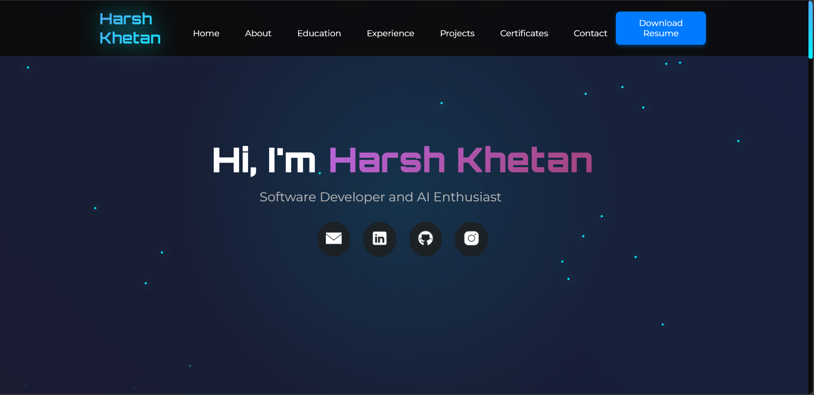

# 🚀 Harsh Khetan | Portfolio Website

Welcome to my **personal developer portfolio**, built with pure HTML, CSS, and JavaScript. This portfolio showcases my **projects, skills, certifications, experience, and academic background** in an immersive, animated, and responsive design.

🌐 **Live Site**: [harsh-khetan-portfolio.vercel.app](https://harsh-khetan-portfolio.vercel.app)

---

## ✨ Features

- 🔥 **Neon UI Design** – Clean and modern interface with glowing elements and glassmorphism.
- 🌀 **Animated Backgrounds & Particles** – Adds depth and visual appeal using CSS animations.
- 💡 **Responsive Design** – Works seamlessly across mobile, tablet, and desktop.
- 🧠 **Skills Cube** – Interactive rotating cube displaying core programming skills.
- 💼 **Project Showcase** – Includes links and brief summaries of major projects.
- 📜 **Certifications Section** – Visual list of verified achievements with clickable proofs.
- 📄 **Downloadable Resume** – Instantly downloadable resume button.
- 🌟 **Custom Cursor Effects** – Neon cursor and trail for unique user interaction.
- ☁️ **Smooth Scroll Navigation** – Scroll-linked sections with animated transitions.

---

## 🛠️ Tech Stack

| Frontend | Animation | UX/UI | Hosting |
|----------|-----------|-------|---------|
| `HTML5`  | `CSS Keyframes`, `JS Event Listeners` | `Neon Theme`, `Glassmorphism`, `Animated Buttons` | [Vercel](https://vercel.com/) |
| `CSS3`   | `CSS Variables`, `@media queries` | `Mobile-Responsive`, `Hover FX`, `Scroll FX` |       |
| `JavaScript` | `Intersection Observer` for visibility | `3D Cube` for skills |         |

---

## 📁 Folder Structure

├── index.html # Main HTML structure

├── styles.css # Advanced CSS styling with responsiveness and animations

├── script.js # JavaScript for interactivity and animations

└── Resume1.pdf # Downloadable resume (linked in HTML)

---

 ## 📞 Contact Me  

💡 Have questions or want to collaborate? Feel free to reach out!  

📧 **Email:** harshkhetan20@gmail.com 

🌐 **GitHub:** HarshKhetan20 (https://github.com/HarshKhetan20)

💼 **LinkedIn:** HarshKhetan20 (https://www.linkedin.com/in/harshkhetan20/)

---

## 🚧 Future Improvements

- Add blog section with Markdown-rendered posts
- Integrate GitHub API to display live repositories
- Add light/dark mode toggle
- Deploy as a PWA for offline access

---

## 📝 License

This project is licensed under the **MIT License**. Feel free to fork, use, and build upon it — just give credit! 🙏

---

## 👨‍💻 Author

Created by [Harsh Khetan](https://github.com/HarshKhetan20). 

Feel free to reach out for any questions or improvements!

## ❤️ Built with passion and pixels.

